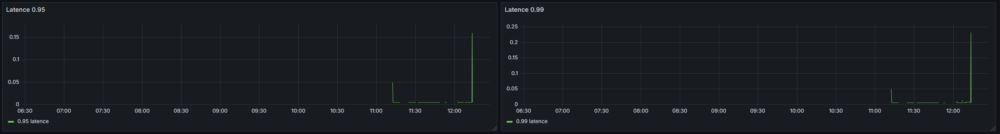
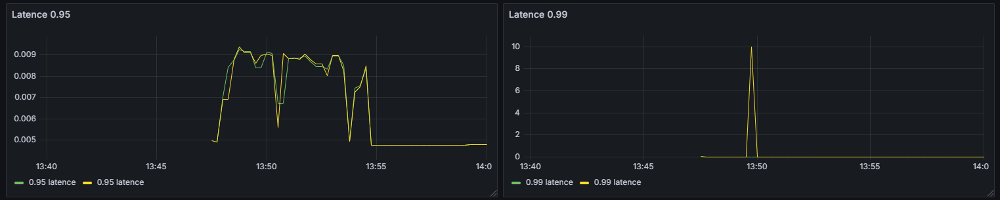

# Projet_LOG430

Cette application comporte deux bases de données distinctes, correspondant à différents niveaux couches.
Une couche correspond à la base de données du magasin local, et l’autre à la base de données du serveur centre logistique. Dans l'application du magasin, le client peut rechercher des produits disponibles en magasin, acheter des produits, consulter la liste complète des produits, ainsi que retourner une vente. De plus, le magasin local met à jour ses inventaires dans la base de données mère afin que, lorsqu’un gestionnaire consulte un rapport, les données soient à jour. Le gestionnaire peut également visualiser les performances des magasins à l’aide d’un tableau de bord. Les employés du magasin, en tant qu’administrateurs, peuvent envoyer une demande d'approvisionnement pour un produit via l’application dans la catégorie `consultation`.


## Prérequis
Avant de commencer, assurez-vous d'avoir les éléments suivants :
- Rust
- Cargo
- Docker
- PostgreSQL

## Installation
1. Cloner le repo
```
git clone https://github.com/Barlow-Personal-Git/Projet_LOG430.git
```
2. Configurer PostreSQL:
```
psql -U postgres
CREATE DATABASE log430_magasin;
CREATE DATABASE log430_cl;
```
3. Configurer les variables d'environnement
Pour chaque sous-projet (magasin, centre_logistique, maison_mere), configurez les variables d'environnement en copiant le fichier d'exemple et en le renommant :
```
cp .env-example .env
```

4. Création des tables
Les migrations sont gérées via Diesel.
```
cd centre_logistique
diesel migration run
```

```
cd magasin
diesel migration run
```

5. Ajouter des données initiales
```
cd centre_logistique
cargo run seed
```

```
cd magasin
cargo run seed
```

## Exécution local du magasin
1. Exécuter le programme
```
cargo run -p magasin login 
```

## Exécution local du magasin en ligne
1. Exécuter le programme
```
cargo run -p magasin_enligne
```

## Exécution local du centre logistique
1. Exécuter le programme
```
cargo run -p centre_logistique
```

## Exécution local du maison mere
1. Exécuter le programme
```
cargo run -p maison_mere
```

## Exécution des tests de stress
```
cd centre_logistique
cd test_stress
k6 run load_test_consulter_inventaire.js
k6 run load_test_produit.js
k6 run load_test_transaction.js
```

## Comparaison avec et sans NGINX

Sans NGINX




Avec NGINX (load balancer)




Lors de tests réalisés avec deux instances (N=2) un load balancer, la performance de mon programme devient instable. On observe une augmentation notable de la consommation CPU et mémoire, ainsi qu'une fréquence plus élevée d'erreurs 500. Les graphes ont été générés avec Grafana. Le fichier JSON correspondant au tableau de bord est accessible dans le répertoire `docs/grafana`.


## Construire et lancer le conteneur à l'aide de Docker Compose

Pour créer l'image Docker à l'aide de la configuration `docker-compose.yml` et du fichier `Dockerfile`, exécutez la commande suivante dans le terminal : 

```bash
docker compose build
```
Cette commande crée une image Docker contenant l'application et ses dépendances.

Ensuite, pour lancer l'application dans un conteneur Docker, utilisez la commande suivante : 
```bash
docker compose up
```
Cette commande permet de lancer le conteneur basé sur l'image constuite et affiche les logs de l'application.

Le programme utilise un API Gateway, après que les containers image sont up.


Pour tester le fonctionnement de l'API Gateway avec Kong. (Ceci est testé dans un serveur Windows, puisque le serveur Linux n'avait pas suffisamment d'espace pour rouler le docker)

Créer un upstream :

```
Invoke-RestMethod -Method Post -Uri http://localhost:8001/upstreams -Body @{ name = "centre_logistique_upstream" } -ContentType "application/x-www-form-urlencoded"
```

Ajouter les instances : 
```
Invoke-RestMethod -Method Post -Uri http://localhost:8001/upstreams/centre_logistique_upstream/targets -Body @{ target = "centre_logistique_app_1:8000"; weight = 100 } -ContentType "application/x-www-form-urlencoded"

Invoke-RestMethod -Method Post -Uri http://localhost:8001/upstreams/centre_logistique_upstream/targets -Body @{ target = "centre_logistique_app_2:8000"; weight = 100 } -ContentType "application/x-www-form-urlencoded"

```

Créer un service Kong : 
```
Invoke-RestMethod -Method Post -Uri http://localhost:8001/services -Body @{
    name = "centre_logistique"
    url = "http://centre_logistique_upstream"
} -ContentType "application/x-www-form-urlencoded"
```

Créer une route pour ce service
```
Invoke-RestMethod -Method Post -Uri http://localhost:8001/services/centre_logistique/routes -Body @{
    paths = "/centre-logistique"
    strip_path = "true"
} -ContentType "application/x-www-form-urlencoded"
```

Exemple pour tester : 
```
 http://localhost:8002/centre-logistique/api/produits
```


# La structure de l'application

L’organisation de cette application suit une approche MVC (Modèle-Vue-Contrôleur), inspirée par des frameworks comme Laravel et ASP.NET MVC, adaptée à un contexte Python/Flask.

Arborescence et rôles des dossiers principaux
`app/` : Contient l’ensemble des éléments backend liés à la logique métier et aux traitements :
- `controllers/` : gestion des contrôleurs.
- `models/` : définition des modèles de données et accès à la base.
- `routes/` (à venir) : gestion des routes HTTP et API.
- `api/` (à venir) : gestion des requêtes API externes ou internes.

`docs/` : Documentation technique regroupant :
- Diagrammes UML 4+1 (architecture logique, processus, déploiement…).
- ADR (Architecture Decision Records) détaillant les choix techniques.

`github/` : Contient les workflows et fichiers de configuration pour l’intégration continue et le déploiement automatisé.

`seed/` : Données initiales pour la base, permettant le peuplement automatique lors de l’installation ou du développement.

`tests/` : Tests unitaires et fonctionnels assurant la qualité et la stabilité du code.

`views/` : Partie Vue du MVC, destinée à l’affichage et à l’interaction utilisateur.
Note : Pour l’instant, ce dossier contient principalement les fonctions d’entrée (input) et d’affichage (print).

`main_server` : Dossier dédié au serveur mère. Sa structure actuelle est fonctionnelle, mais elle sera améliorée prochainement pour adopter une architecture MVC complète.

## Point d'exécution
`app.py` :Programme principal pour l’application magasin local.
`main_server/server.py` : Programme principal pour le serveur mère, responsable de la base de données centrale et des rapports consolidés.

# Choix des applications

`Python` : Parmi tous les langages que j'ai utilisés au fil des années, Python est celui avec lequel j'ai le moins d'expérience, en excluant Rust. Étant donné que de nombreuses entreprises demandent aujourd’hui des compétences en Python, il est pertinent pour moi de me familiariser davantage avec ce langage à travers ce projet.

`Console CLI` : Initialement, je prévoyais de créer une application web complète. Cependant, la ligne de commande (CLI) permet de simplifier la majorité des tâches.

`Github` : Je suis plus familier avec GitHub qu’avec GitLab, tant pour le versionnage que pour l’intégration de workflows CI/CD.

`pylint` : C'est un outil proposé pour l’analyse statique de code afin de maintenir un bon niveau de qualité, détecter les erreurs potentielles et appliquer un style de code..

`pytest` : Un framework simple pour effectuer les tests unitaires.

`SQLAlchemy` : C'est un ORM pour interagir avec la base de données.

`PostgreSQL` : C’est une base de données relationnelle simple à utiliser et plus cohérente avec les besoins du projet qu’une base de données NoSQL.
