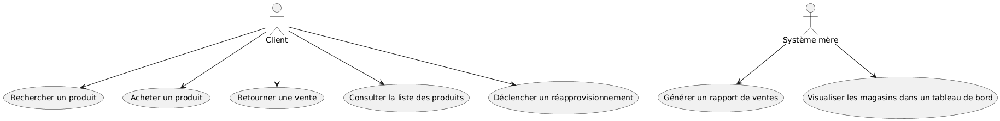

Lien de mon repos : https://github.com/Barlow-Personal-Git/LOG430_Barlow_Etape_1

# 1. Introduction et objectifs

Ce projet est une application de gestion d'inventaire pour un réseau de magasins, dans le cadre du cours LOG430. Elle permet de consulter, acheter, retourner des produits et synchroniser les inventaires locaux avec un serveur mère. Ce laboratoire vise à familier les outils pour créer un projet de haut niveau.

# 2. Contraintes
- Langage principal : Rust
- Base de données : PostgreSQL
- Interface : CLI (ligne de commande)
- Framework web pour le serveur mère : Flask
- Test : Pytest
- Style : Pylint
- Répertoire : Github

# 3. Principes architecturaux

Mon principe architectural repose sur le modèle MVC : `models/`, `views/` et `controllers/`.
L’application principale du laboratoire suit cette structure de manière organisée. Cependant, le serveur mère n’est que partiellement structuré selon MVC. En effet, la vue et les contrôleurs n’y sont pas encore séparés. Actuellement, l’ensemble du code du serveur mère est contenu dans un seul fichier : server.py.

Les fichiers sont organisés selon leur comportement ou rôle :
- Les documents d’architecture et les diagrammes sont dans le dossier `docs/`
- Les tests unitaires sont regroupés dans `tests/`
- Les données initiales (seed) sont placées dans `seed/`
  
# 4. Contexte

## Contexte fonctionnel
- Il y a deux bases de données : une locale (magasin) et une centrale (serveur mère)
- Le client peut :
  - Rechercher un produit
  - Acheter un produit
  - Consulter l'inventaire
  - Retourner un vente
- Un administration qui joue le rôle du client peut :
  - Envoyer des demandes d'approvisionnement

- Le serveur peut :
  - Obtenir un rapport
  - Consulter un tableau bord

## Contexte technique
- PostgreSQL pour les deux bases de données
- Exécution local avec CLI
- Serveur mère roule avec Flask

# 5. Scénarios d'utilisation

- UC1 – Rechercher un produit : Un client peut consulter les produits par identifiant, catégorie ou nom.
- UC2 – Acheter un produit : Un client peut ajouter des produits à une vente et confirmer son achat.
- UC3 – Retourner une vente : Un client peut retourner une vente effectuée précédemment dans le même magasin.
- UC4 – Consulter la liste des produits : Un client peut consulter l’inventaire complet du magasin.
- UC5 – Déclencher un réapprovisionnement : Un employé du magasin peut envoyer une demande de réapprovisionnement.
- UC6 – Générer un rapport de ventes : Un gestionnaire peut générer un rapport détaillé contenant des informations sur les magasins, les ventes et les inventaires.
- UC7 – Visualiser les magasins dans un tableau de bord : Un gestionnaire peut consulter un tableau de bord pour avoir une vue d’ensemble de la situation des magasins.

# 6. Structure logique

- `app/` : backend du magasin local
  - `models/` : classes de données
  - `controllers/` : Logique des opérations
  - `views/` : les valeurs entrées/sorties dans le console
  
- `main_server/` : serveur mère
  - `models/` : classes de données

# 7. Structure de développement

- `docs/` : UML 4+1, ADR et rapport final
- `seed/` : les données initiales pour la BD
- `tests/` : tests unitaires
- `github/` : workflows CI/CD
  
# 8. Déploiement

- Dépendances gérées par `requirements.txt`
- Configuration via `.env`
- Lancement : `python3 app.py` (magasin), `python3 -m main_server.server` (serveur)
- Docker : `docker compose up`

# 9. Crosscutting concepts

Dans l’application côté magasin, les entrées sont validées afin d’assurer l’intégrité des données saisies par l’utilisateur.
Les utilisateurs sont classés selon deux rôles :
- "user" pour les clients
- "admin" pour les employés du magasin
Ces rôles déterminent les actions accessibles à chaque type d'utilisateur. Par exemple, seuls les administrateurs peuvent envoyer des demandes de réapprovisionnement.
Par ailleurs, les requêtes critiques sont encapsulées dans des blocs `try/except` .

Ensuite, j’ai implémenté le patron de conception Singleton pour le client, puisqu’il est utilisé à plusieurs reprises tout au long de l’exécution de l’application. Cela permet d’éviter de devoir passer l’instance du client manuellement à chaque fois et garantit qu’une seule instance est utilisée de manière cohérente.

# 10. Décisions d’architecture (ADR)

## Titre 1
Choix de mécanisme de base de données (SQL vs NoSQL, local vs serveur)

## Contexte
Je dois choisir un mécanisme de base de donner pour l'application de système de caissier dans un magasin :
- Je veux que les données sont classées dans des tableaux. 
- Je veux qu'il soit facile à maintenir.
- Je veux que les données puissent être utilisées localement.

## Décision
J'ai décidé d'utiliser une base de données SQL, car elle est plus approprié pour structurer les données sous forme de tables avec des relations entre elles. Cela permet de faciliter la maintenance.  La base de donnée sera en serveur, car l'application sera utilisée sur plusieurs magasins.

## Statut
Accepté

## Conséquences
1. Plusieurs tables relationnelles seront créées pour modéliser les entités de l'application.
2. Les données seront sauvegradées localement sur l'appareil. Il faudra mettre en place une méthode de sauvegarde régulière pour en cas de changement d'appareil.
3. Le système ne dépendra pas à un réseau de connexion.
4. Changer de mécanisme de base de données sera un défi, car les requêtes nécessaires pour obtenir les mêmes résultats ne seront pas identiques.

## Titre 2
Choix de mécanisme de base de données (SQL vs NoSQL, local vs serveur)

## Contexte
Je dois choisir un mécanisme de base de donner pour l'application de système de caissier dans un magasin :
- Je veux que les données sont classées dans des tableaux. 
- Je veux qu'il soit facile à maintenir.
- Je veux que les données puissent être utilisées localement.

## Décision
J'ai décidé d'utiliser une base de données SQL, car elle est plus approprié pour structurer les données sous forme de tables avec des relations entre elles. Cela permet de faciliter la maintenance.  La base de donnée sera en serveur, car l'application sera utilisée sur plusieurs magasins.

## Statut
Accepté

## Conséquences
1. Plusieurs tables relationnelles seront créées pour modéliser les entités de l'application.
2. Les données seront sauvegradées localement sur l'appareil. Il faudra mettre en place une méthode de sauvegarde régulière pour en cas de changement d'appareil.
3. Le système ne dépendra pas à un réseau de connexion.
4. Changer de mécanisme de base de données sera un défi, car les requêtes nécessaires pour obtenir les mêmes résultats ne seront pas identiques.
   

# 11. Qualité

## Maintenabilité
- Le projet suit une architecture inspirée de MVC pour faciliter la maintenance.
- La séparation des responsabilités entre models, controllers et views permet de facilement modifier le code.

## Testabilité
- Les tests unitaires sont organisés dans un dossier `tests/` et utilisent le framework `pytest`

## Réutilisabilité
- En utilisant le patron de conception Singleton pour le client permet d'assurer la limite de la duplication d'instance.

# 12. Risques

- La structure MVC n’est pas encore complètement appliquée dans le dossier `main_server`, ce qui rend le code moins modulaire et difficile à maintenir.
- Connaissances limitées en conception architecturale avancée, ce qui peut affecter la qualité globale de l’architecture logicielle.
- Absence d’interface utilisateur graphique
- La couverture des tests unitaires n’atteint pas 100 %, ce qui laisse place à des bugs non détectés.
- Connaissances encore limitées en Python, ce qui peut ralentir le développement et la résolution de problèmes techniques.
- Les cas d’utilisation prévus pour le laboratoire 2 ne sont pas encore entièrement complétés.
- Le fichier server.py est devenu plus complexe, car il regroupe toute la logique du serveur mère sans séparation claire des responsabilités selon le modèle MVC.
