Lien de mon repos : https://github.com/Barlow-Personal-Git/Projet_LOG430

# 1. Introduction et objectifs

Ce projet est une application de gestion d'inventaire pour un réseau de magasins, dans le cadre du cours LOG430. Elle permet de consulter, acheter, retourner des produits et synchroniser les inventaires locaux avec le centre logistique. La maison mère peut générer des rapports et consulter un tableau pour évoluer la performance des magasins. Ce laboratoire vise à familier les étudiants avec les outils nécessaires à la création d'un projet de haut niveau, tels que API Request, Grafana et Prometheus.

Pour les laboratoires 3 et 4, les métriques et Swagger ont été implémentés dans Centre Logistique, car au moment où je travaillais dessus, seul Centre Logistique disposait d’API Request.

L'objectif de l'étape 2 est d'implémenter Swagger, des outils d’observation, d’appliquer l’architecture microservice et d’ajouter une API Gateway.

# 2. Contraintes
- Langage principal : Rust
- Base de données : PostgreSQL
- Interfaces : CLI (ligne de commande) pour le magasin et application Web pour la maison mère  et le magasin en ligne 
- Framework web pour le serveur mère : Rocket
- Test : `cargo test` PAS IMPLÉMENTER
- Style : `cargo fmt`
- Répertoire : Github
- Observabilité : Prometheus pour la collecte de métrique et Grafana pour la visualisation des métriques
- Load Balacing : nginx
- Tests de stress : kk6
- Api Gateway : Kong

# 3. Principes architecturaux

Mon principe architectural repose sur le modèle MVC : 
- `models/` : Contient les structures représentant les entités de la base de données (ex.: produits, client, inventaires, transactions). 
- `templates/` ou `views` : Ce dossier est utilisé différemment selon l'interface. Pour le magasin, il sert à générer des phrases lisibles affichées dans le terminal. Pour la maison mère, il est utilisé avec Tera pour générer des pages HTML affichant le contenu. 
- `controllers/` : Contient les routes Rocket telles que Get et Post. Ils gèrent les requêtes et les interagissent avec les models. Ils retournent soit un JSON pour les api request ou soit des templates Tera.
L’application principale du laboratoire suit cette structure de manière organisée. L'application Centre Logistique ne suive pas cette architecture, puisqu'il n'a pas besoin d'un interface utilisateur.

Les fichiers sont organisés selon leur comportement ou rôle :
- Les documents d’architecture et les diagrammes sont dans le dossier `docs/`
- Les tests unitaires sont regroupés dans `tests/`
- Les données initiales (seed) sont placées dans `seed/`

Après être arrivé au laboratoire 5, j’ai remarqué que c’était le magasin qu’il fallait améliorer et non centre logistique. Il était donc trop tard pour changer.

# 4. Contexte

## Contexte fonctionnel
- Il y a deux bases de données : une locale (magasin) et une centrale
- Le client peut :
  - Rechercher un produit
  - Acheter un produit
  - Consulter l'inventaire
  - Retourner un vente

- Le serveur côté centre_logistique peut :
  - Faire des appels API Request
  - Vérifier les Swaggers
  - Vérifier les métriques

- Le serveur côté maison mère peut :
  - Obtenir un rapport
  - Consulter un tableau

- Les employeurs qui occupent le centre logistique peuvent consulter grafana et promeuteus pour voir les requêtes s'ils fonctionnent bien correctement.

## Contexte technique
- PostgreSQL pour les deux bases de données
- Exécution local avec CLI
- Serveur maison mere et centre logistique roulent avec Rocket (Rust)

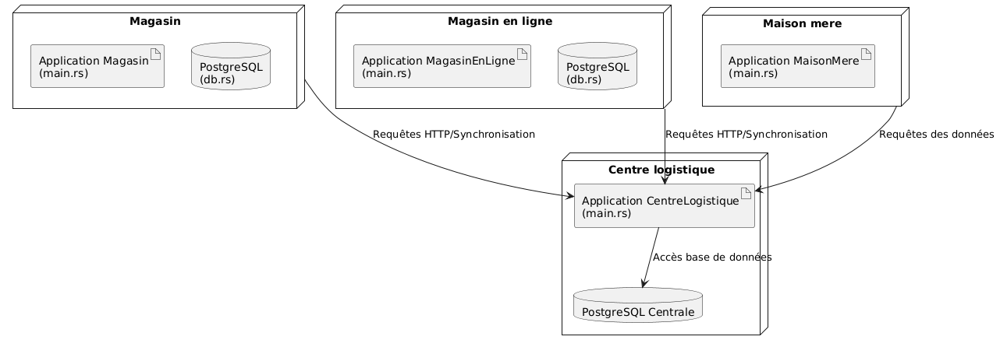

Le magasin en ligne et le magasin ont le même comportement. Cependant, le magasin en ligne est une application web, tandis que le magasin est une application CLI. Ce système repose sur une architecture DDD, où chaque domaine constitue un monolithe organisé selon le modèle MVC.

# 5. Scénarios d'utilisation

- UC1 – Rechercher un produit : Un client peut consulter les produits par identifiant, catégorie ou nom.
- UC2 – Acheter un produit : Un client peut ajouter des produits à une vente et confirmer son achat.
- UC3 – Retourner une vente : Un client peut retourner une vente effectuée précédemment dans le même magasin.
- UC4 – Consulter la liste des produits : Un client peut consulter l’inventaire complet du magasin.
- UC5 – Déclencher un réapprovisionnement : Un employé du magasin peut envoyer une demande de réapprovisionnement.
- UC6 – Générer un rapport de ventes : Un gestionnaire peut générer un rapport détaillé contenant des informations sur les magasins, les ventes et les inventaires.
- UC7 – Visualiser les magasins dans un tableau de bord : Un gestionnaire peut consulter un tableau de bord pour avoir une vue d’ensemble de la situation des magasins.
- UC8 - Visualiser les métriques du centre logistique : un gestionnaire peut consulter les métriques et tester les API requests avec Swagger.
- UC9 - Visualiser les tableaux dans Grafana : un gestionnaire peut observer les performances de l'application.

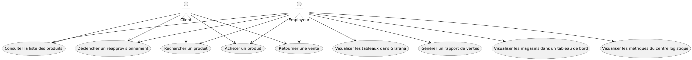

Trois exemples du fonctionnement lorsque l'utilisateur achete, consulte et recherche un produit.

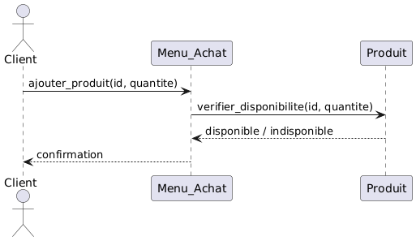

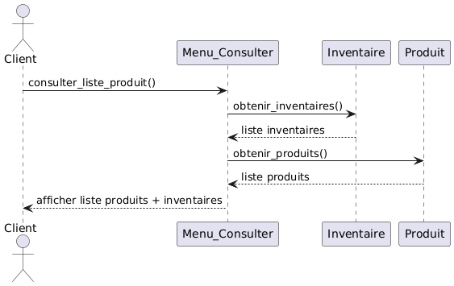

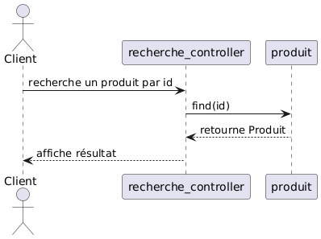

# 6. Structure logique

Les modèles sont représentés comme illustré dans le diagramme de classes du centre logistique.

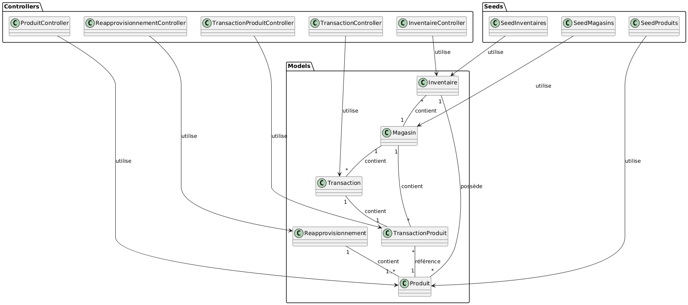
- `centre_logistique/` : Représente le lien entre les magasins et la maison mère.
  - `migration/` : Contient la création des tables.
  - `src/` : Contient le code source de l'application `centre_logistique`.
    - `controllers/` : Contient les routes et la logique de contrôle des requêtes.
    - `models/` : Contient les définitions des entités.
    - `seed/` : Contient l'insertion des données initiales.
    - `cache.rs` : Gestion du cache.
    - `db.rs` : Gestion de la connexion de la base de données.
    - `dto.rs` : Définitions des objets de transfert de données à un autre.
    - `main.rs` : Point d'entrée principal de l'application.
    - `metrics.rs` : Gestion des métriques de l'application.
    - `routes.rs` : Définition des routes de l'application.
    - `schema.rs` : Schéma de la base de données pour l'ORM.
  - `test_stress/` : Contient les tests de stress pour le centre logistique.

Les modèles sont représentés comme illustré dans le diagramme de classes du magasin.

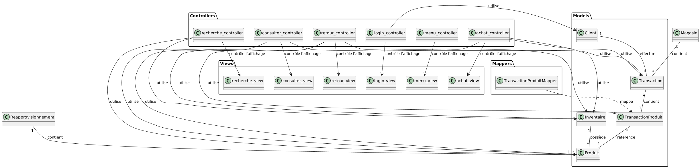

- `magasin/` : Contient le code pour le magasin CLI.
  - `migration/` : Contient la création des tables.
  - `src/` : Contient le code source de l'application `magasin`.
    - `controllers/` : Contient les routes et la logique de contrôle des requêtes.
    - `models/` : Contient les définitions des entités.
    - `seed/` : Contient l'insertion des données initiales.
    - `db.rs` : Gestion de la connexion de la base de données.
    - `dto.rs` : Définitions des objets de transfert de données à un autre.
    - `main.rs` : Point d'entrée principal de l'application.
    - `session` : Contient la structure de base du client singleton.
    - `schema.rs` : Schéma de la base de données pour l'ORM.

- `magasin_enligne/` : Contient le code pour le magasin en ligne.
  - `migration/` : Contient la création des tables.
  - `src/` : Contient le code source de l'application `magasin_enligne`.
    - `controllers/` : Contient les routes et la logique de contrôle des requêtes.
    - `models/` : Contient les définitions des entités.
    - `seed/` : Contient l'insertion des données initiales.
    - `db.rs` : Gestion de la connexion de la base de données.
    - `dto.rs` : Définitions des objets de transfert de données à un autre.
    - `main.rs` : Point d'entrée principal de l'application.
    - `session` : Contient la structure de base du client singleton.
    - `routes.rs` : Définition des routes de l'application.
    - `schema.rs` : Schéma de la base de données pour l'ORM.
  - `templates/` : Contient les fichier Tera/html

- `maison_mere/` : Contient le code pour la maison mère.
  - `fonts/` : Contient les fonts pour la génération des pdfs.
  - `src/` : Contient le code source de l'application `maison_mere`.
    - `controllers/` : Contient les routes et la logique de contrôle des requêtes.
    - `models/` : Contient les définitions des entités.
    - `seed/` : Contient l'insertion des données initiales.
    - `db.rs` : Gestion de la connexion de la base de données.
    - `dto.rs` : Définitions des objets de transfert de données à un autre.
    - `main.rs` : Point d'entrée principal de l'application.
    - `session` : Contient la structure de base du client singleton.
    - `routes.rs` : Définition des routes de l'application.
    - `schema.rs` : Schéma de la base de données pour l'ORM.
  - `templates/` : Contient les fichier Tera/html

# 7. Structure de développement

- `docs/` : UML 4+1, ADR et rapport final
- `seed/` : les données initiales pour la BD
- `github/` : workflows CI/CD
- `migration/` : les scripts SQL de migration de base de données
  
Voici un aperçu de l’implémentation de mon centre logistique. Le fichier principal pour exécuter l’application est `main.rs`, qui appelle `routes.rs`, puis exécute les contrôleurs.
  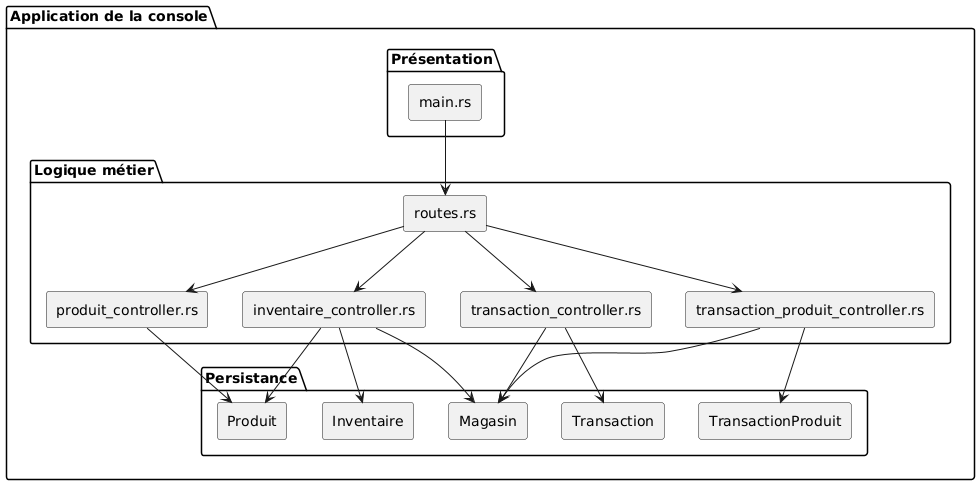

Voici un aperçu du implémentation du magasin, le fichier principal pour exécuter l’application est `main.rs`, qui appelle `login_controller` pour récupérer l’identité de l’utilisateur, puis exécute le reste du fonctionnement.
  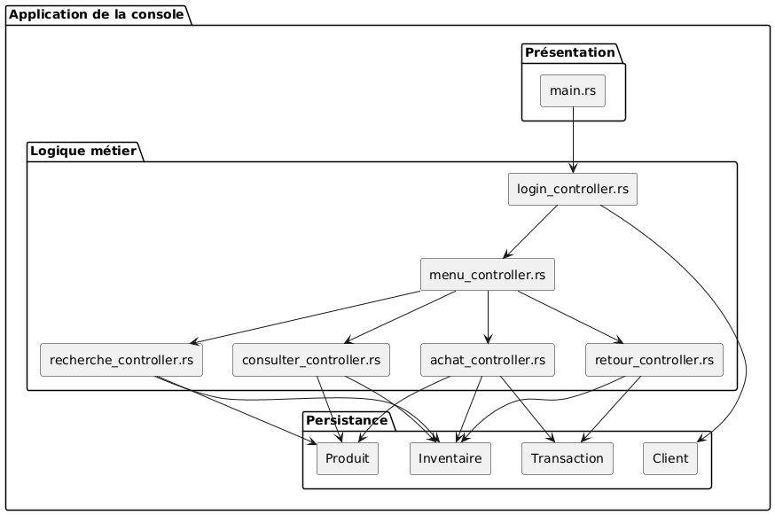

# 8. Déploiement

- Dépendances gérées par `Cargo.toml` et `Cargo.lock`
- Configuration via `.env`
- Lancement : 
  - Lancement en local :
  - Magasin CLI** : `cargo run -p magasin login`
  - **Magasin en ligne : `cargo run -p magasin_enligne`
  - **Centre logistique : `cargo run -p centre_logistique`
  - Maison mère : `cargo run -p maison_mere`
- Docker : `docker compose up`

# 9 Observabilité et résultats de monitoring

Dans cette section, deux observations ont été réalisées sur la performance du centre_logistique, car lors du laboratoire 4, seul le centre_logistique disposait d’API REST.

Sans load balacing
  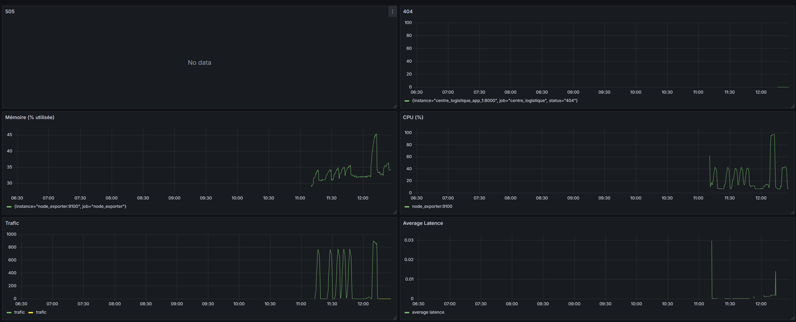
  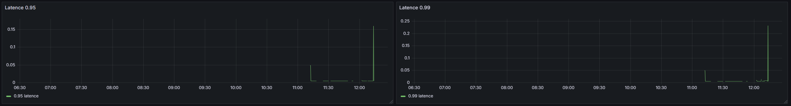

Mes tests de stress n’étaient pas très poussés. Ce que j’ai remarqué, c’est que lorsque je n’applique pas de load balancing, à chaque exécution, on observe une augmentation du trafic, de l’utilisation de la mémoire et du CPU. J’ai également constaté que le système de cache fonctionne parfaitement, car les latences restent faibles.

Avec load balancing sur deux instances
  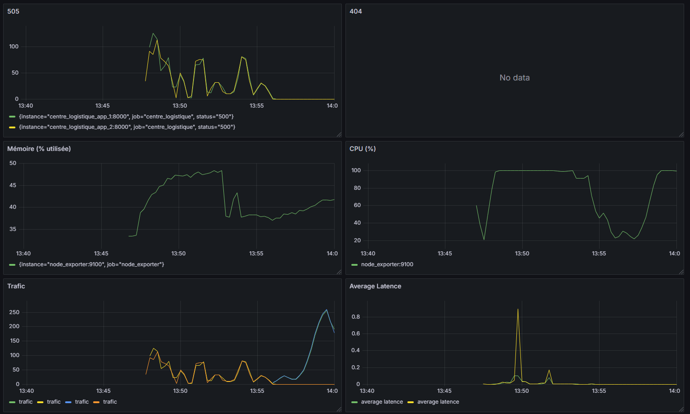
  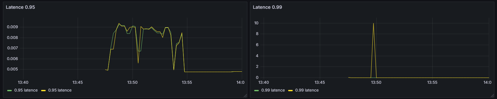

Ce que je constate ici, c’est que les erreurs 500 se produisent lorsqu’il y a une surcharge d’utilisateurs.
De plus, l’utilisation de la mémoire et du CPU augmente considérablement.
Les latences sont élevées au début, car le cache n’est pas encore actif, mais une fois le cache en place, la latence reste relativement faible.

# 10. Crosscutting concepts

Dans l’application côté magasin, les entrées sont validées afin d’assurer l’intégrité des données saisies par l’utilisateur.
Les utilisateurs sont classés selon deux rôles :
- "user" pour les clients
- "admin" pour les employés du magasin

Dans le coté centre logistique, il utilie `tracing` pour la journalisation. Lorsqu'un utilisateur utilise l'application, un fichier `logs.json` est créé et tous les logs y sont enregistrés. Les metrics Prometheus sont exporté via le fichier `metrics.rs`.

Pour la sécurité des entrées côté serveur n'est pas encore implémenté. 

L'application utilise `.env` pour faciliter la configuration du projet.

# 11. Décisions d’architecture (ADR)

## Titre 1
Choix de mécanisme de base de données (SQL vs NoSQL, local vs serveur)

## Contexte
Je dois choisir un mécanisme de base de donner pour l'application de système de caissier dans un magasin :
- Je veux que les données sont classées dans des tableaux. 
- Je veux qu'il soit facile à maintenir.
- Je veux que les données puissent être utilisées localement.

## Décision
J'ai décidé d'utiliser une base de données SQL, car elle est plus approprié pour structurer les données sous forme de tables avec des relations entre elles. Cela permet de faciliter la maintenance.  La base de donnée sera en serveur, car l'application sera utilisée sur plusieurs magasins.

## Statut
Accepté

## Conséquences
1. Plusieurs tables relationnelles seront créées pour modéliser les entités de l'application.
2. Les données seront sauvegradées localement sur l'appareil. Il faudra mettre en place une méthode de sauvegarde régulière pour en cas de changement d'appareil.
3. Le système ne dépendra pas à un réseau de connexion.
4. Changer de mécanisme de base de données sera un défi, car les requêtes nécessaires pour obtenir les mêmes résultats ne seront pas identiques.

## Titre 2
La stratégie de persistence

## Contexte
Je dois choisir une base de donnée pour l'application de système de caissier dans un magasin :
- Je veux que l'utilisation est simple.
- Je veux pouvoir accéder rapidement aux données, pour garantir une utilisation fluide.
- Je veux que les données puissent être utilisées même si le réseau est hors service, afin d'assurer la continuité du service.

## Décision
J'ai décidé d'utiliser PostgreSQL comme base de données locale puisque le système se déroulera sur plusieurs magasin et une maison mère. Une base de donné NoSQL comme MongoDB ne serait pas idéale pour cette application, car elle est mieux adaptée à des systèmes distribués ou à forte volumétrie. PostgreSQL est simple à utiliser et peut être facilement configurée dans la machine virtuelle Linux fournie par l'école.

## Statut
Accepté

## Conséquences
1. Le système sera fonctionnelle hors ligne, ce qui évitera toute interruption en case de coupure du réseau.
2. L'utilisation de PostgreSQL est simple et permet une manipulation facile des données.
3. La gestion des connexions simultanées devra être surveillée si le système évolue vers une architecture multi-clients avec beaucoup de trafic.
4. PostgreSQL consomme plus de ressources qu’une base embarquée comme SQLite, ce qui peut poser problème
5. Le déploiement sur plusieurs machines nécessitera une synchronisation manuelle ou via un serveur central.

## Titre 3
Choix du langage de programmation : Rust vs Python

## Contexte
Pour développer le système du magasin et le centre logistique, je dois choisir un langage de programmation adapté aux exigences suivants :
- Je veux un langage peu utilisé dans le cours pour découvrir de nouvelles technologies.
- Je veux un langage qui facilite la maintenance du code
- Je veux un langage qui permette de développer aussi bien le frontend que le backend.
- Je veux un langage qui s’intègre facilement avec la base de données.

## Décision
J’ai décidé d’utiliser Rust pour la deuxième étape. Python était intéressant au début, mais j’ai rencontré des difficultés pour héberger une application sur un serveur. Avec Rust et Rocket, je peux exécuter l’application sans avoir à séparer le frontend et le backend. De plus, l’implémentation pour se connecter à la base de données PostgreSQL est nettement plus simple.

## Statut
Accepté

## Conséquences
1. Le développement demandera plus d'efforts initiaux, car Rust est une nouvelle langage pour moi.
2. Le code effectué à l'étape 1 doit reeffecuter mais avec langage Rust.
3. La création des images Docker pourrait représenter un défi.
4. La sécurité de l'application sera meilleure qu’avec Python grâce à l’absence de ramasse-miettes.

## Titre 4
Choix du Load Balancer : NGINX avec Rust

## Contexte
Pour appliquer un load balacer, il doit répondre à ces critères :
- Je veux un outil qui ne demande pas trop de travail pour être mis en place.
- Je veux un outil qui s’intègre facilement dans un environnement Docker.
- Je veux un outil simple à configurer.
- Je veux un outil capable de gérer facilement le nombre d’utilisateurs.

## Décision
J’ai choisi d’utiliser NGINX comme load balancer car il figurait en premier dans la liste proposée par l’énoncé du laboratoire. J'ai trouvé qu'il était facile à configurer dans le docker.

## Statut
Accepté

## Conséquences
1. La configuration du load balancer sera simple.
2. Le load balancer sera déployé en même temps que les dockers images.
3. L’utilisation de NGINX facilite la montée en charge pour gérer un plus grand nombre d’utilisateurs.
4. NGINX bénéficie d’une documentation abondante et d’exemples nombreux disponibles en ligne (ex. https://github.com/nginx/njs-examples/).
  
## Titre 5
Choix du Test de charge : JMeter vs k6

## Contexte
Pour ma décision du test de charge, il doit répondre à ces critères :
- Je souhaite un outil compatible avec Grafana.
- Je souhaite un outil qui facilite la simulation de tests de stress.
- Je souhaite un outil qui ne demande pas trop de travail.

## Décision
J’ai choisi d’utiliser k6, car c’était l’un des deux outils de test de charge que je n’avais pas essayés lors du cours de DevOps. J’avais utilisé JMeter pendant le cours et je l’avais trouvé plus lourd et plus exigeant à utiliser que k6.

## Statut
Accepté

## Conséquences
1. Mise en place plus rapide grâce à la simplicité de k6.
2. Intégration avec Grafana, facilitant la visualisation des résultats en temps réel.
3. Scripts de test faciles à écrire et à maintenir grâce à l’utilisation de JavaScript.
4. Les capacités de test seront limitées par la configuration et la version de k6 utilisée.

# 12. Qualité

## Maintenabilité
- Le projet suit une architecture inspirée de MVC pour faciliter la maintenance.
- La séparation des responsabilités entre models, controllers et views permet de facilement modifier le code.

## Réutilisabilité
- En utilisant le patron de conception Singleton pour le client permet d'assurer la limite de la duplication d'instance.

## Performance
- Les requêtes SQL sont optimisées via l'ORM Diesel pour limiter la surcharge sur la base de données.

# 13. Risques

Plusieurs risques sont présentes actuallement dans le projet : 
- L’application magasin en ligne n’a pas été configurée avec un système de cache et ne dispose pas d’un mécanisme de protection renforcé contre les malwares. Ainsi, un utilisateur non connecté pourrait accéder à certaines pages.
- Aucun test unitaire n’a été réalisé.
- La taille de l’image Docker est trop importante pour être exécutée correctement dans la VM fournie par les chargés de laboratoire.
- L’architecture actuelle n’intègre pas de microservices.
- La sécurité de l’application reste vulnérable, notamment car aucun mécanisme de chiffrement, de contrôle d’accès avancé ou de configuration CORS n’a été mis en place.
- Une partie importante du code a été réalisée avec l’assistance de ChatGPT, mais plusieurs fichiers ont été développés par moi-même, avec l’aide de l’IA pour améliorer et optimiser certaines parties.
